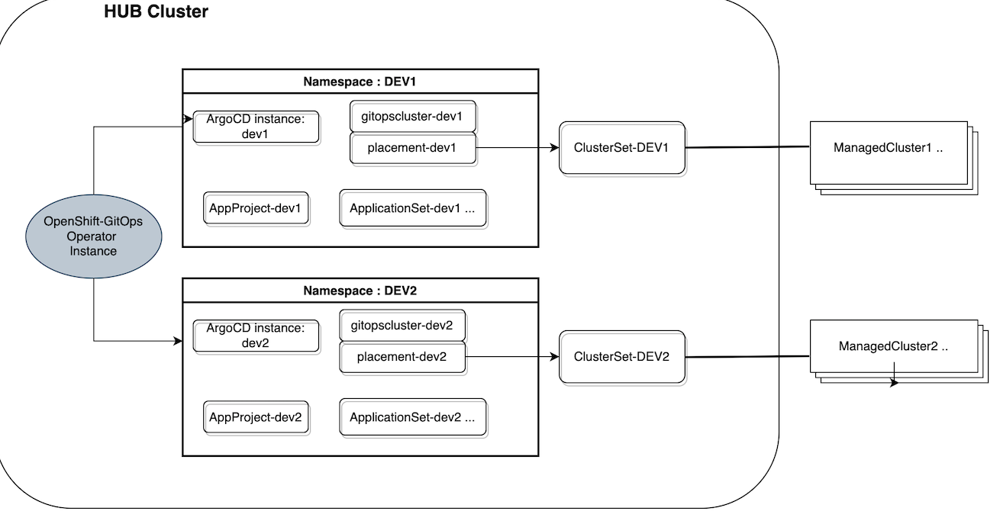

# Overview 

   Goal of this repo is to showcase **ACM - GitOps operator** integration and the **RBAC** configuration to achieve multitenancy.
 
 
 ## An example customer scenario 
 
 The tutorial considers the following sample customer scenario
 
 - An organization with two or more teams [ e.g. team1 and team2 ]
 - Each team maintain and manages its  own projects (applications). [ team1 ->  project: DEV1, team2 -> project: DEV2]
 - Team members granularly access and administer their projects
 - Governance Policies are setup for security complaince.

## An example implementation 

The tutorial demonstrates a sample implementation for the above  customer scenario.

It demos

- integration with GitOps operator
- management of ApplicationSets
- RBAC configuration for multitenancy
- Use of policy-generator for developing policies

TODO: Integration of several other features.

`gatekeeper`,
`namespace-operator`,
`external-secrets/vault`,
`integrity-shield`,
`groupsync-operator`,
`monitoring`,
`argocd-notifications`

### resource layout

This picture gives an overview of the environment installed by tutorial and the layout of various resources setup as part of the installation tutorial.

# Installation (a tutorial will be provided)

A: Policies (later we will convert more objects into Policies using PolicyGenerator)

1. Install-Gitops-Operator
2. Configure-ArgoCD (rbac: policy: g, system:cluster-admins, role:admin, role:SreAdminGrp)
   https://github.com/ch-stark/gitops-rbac-example/blob/main/policies/policy-config-operator-dex.yaml#L91

B: OpenShift-setup 

1. Setup-Groups (ACM-Admins, Dev1-Admins, Dev1-viewers, Dev2-admins, Dev2-viewers, Developers)

2. Setup HTPassword Authentication

C: argo-projects

1. default-project  namespace: openshift-gitops
2. dev1 project   namespace: dev1
3. dev2 project   namespace: dev2
4. policies project namespace: policies
5. ArgoCD-Configuration ConfigMap and ConfigMapRBAC

E: acm-gitops

gitopscluster:

1. default namespace: openshift-gitops
2. dev1  namespace: dev1
3. dev2  namespace: dev2
4. policies namespace: policies

bindings:

1. default  namespace: openshift-gitops
2. dev1  namespace: dev1
3. dev2  namespace: dev2
3. policies  namespace: policies

F: application-sets

1. default  references default-appproject namespace: openshift-gitops
2. dev1 references dev1-appproject namespace: dev1
3. dev2 references dev2-appproject namespace: dev2
4. policies references policies-appproject namespace: policies

Placements

So far we just place all on Hub-Cluster, will be extended

RBAC Use cases:

* a certain user should have all permissions for all Applications and Cluster-Admin-Tasks

   TODO: point to the exact role bindings here 

* a certain user should have readpermissions on one project/Application
   TODO: point to the exact role bindings here 

* a certain user should have admin-permissions on one project
   TODO: point to the exact role bindings here 

* a certain user should have admin-permissions on all projects but not cluster-admin-rights
   TODO: point to the exact role bindings here

* it should show the diffent options regarding RBAC-Configuration
   TODO: point to the exact role bindings here

* a certain user should only see namespaces in a certain ClusterSet
   TODO: point to the exact role bindings here

`
 `

### References

1. https://github.com/christianh814/openshift-cluster-config
2. Security-Features we get with ArgoCD (https://rcarrata.com/openshift/secure-argo-supply-chain/)
3. https://access.redhat.com/documentation/en-us/red_hat_advanced_cluster_management_for_kubernetes/2.4/html/applications/index
4. https://github.com/stolostron/policy-collection/issues/217
5. https://github.com/tosin2013/acm-multi-cluster-argocd-dashboard
6. https://github.com/joatmon08/vault-argocd
7. https://cloud.redhat.com/blog/openshift-authentication-integration-with-argocd
8. https://cloud.redhat.com/blog/openshift-pipelines-and-openshift-gitops-are-now-generally-available
