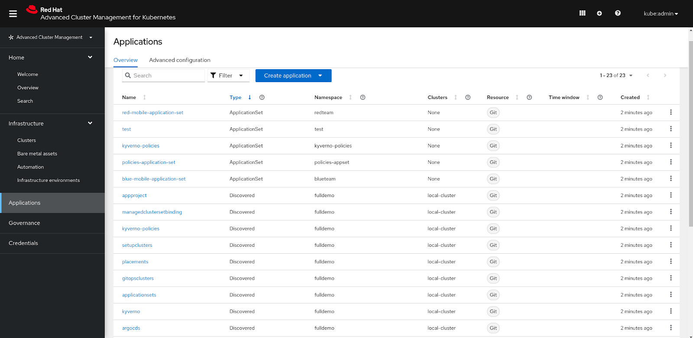
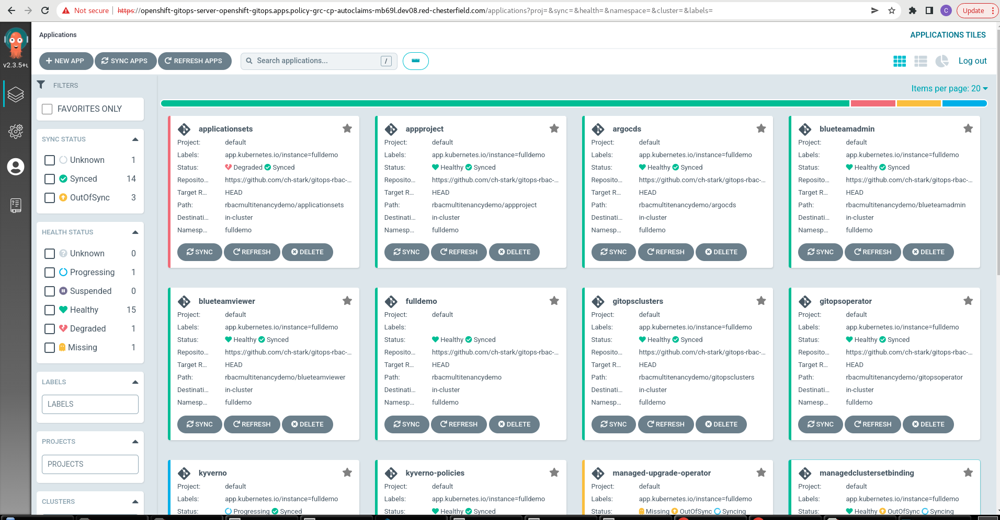
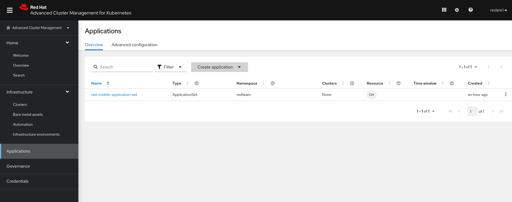
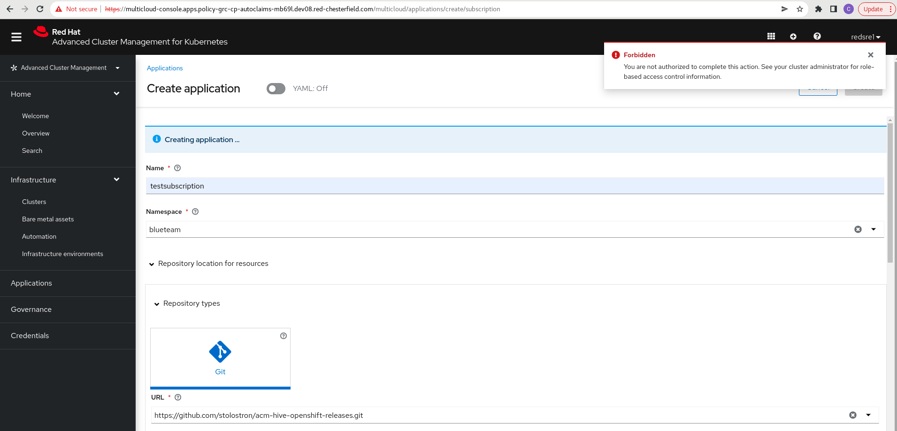
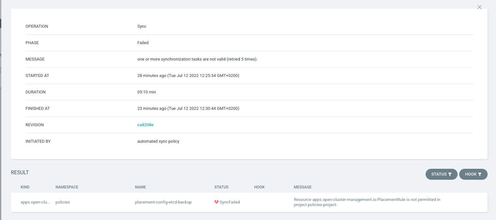
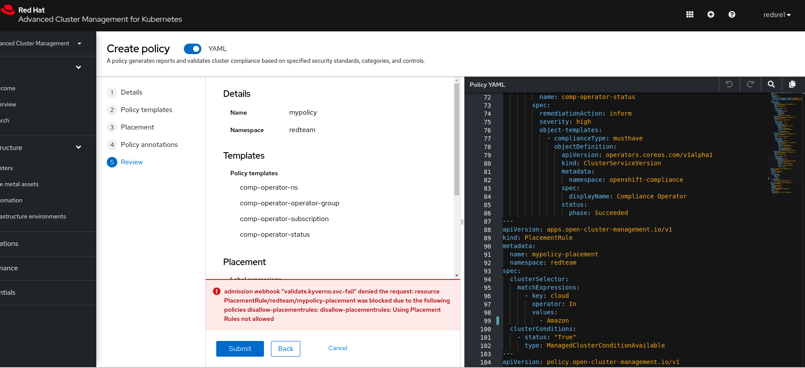
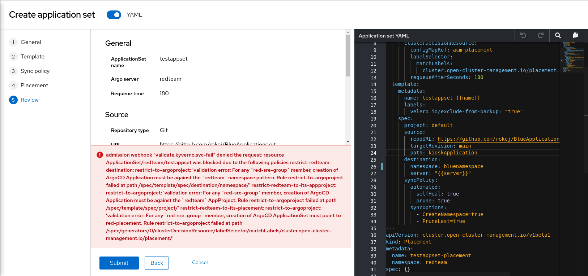
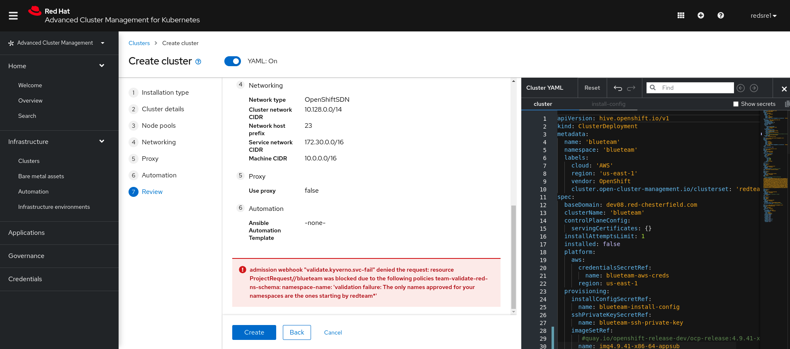

## Configuration Options regarding Multi-Tenancy and RBAC when using GitopsOperator, ApplicationSets, and RHACM

Starting with RedHatAdvanced-Cluster-Management (RHACM 2.5) ApplicationSets have become GA and are ready to use in production.
Starting with GitopsOperator 1.6 ApplicationSets are also GA from an OpenShift Gitops-Operator point of view.

This blog will not give some introduction into RHACM, but it is important to remember that we have a Hub-Spoke architecture
where one Hub-Cluster can manage a significant amount of Managed-Clusters.

This blog provides an overview of available configuration options and best practices for Cluster- and Multicluster Multi-Tenancy.

Sharing clusters saves costs and simplifies administration. However, sharing clusters also present challenges such as security, fairness, and managing `noisy neighbors`. 
Clusters can be shared in many ways. In some cases, different applications may run in the same cluster. 
In other cases, multiple instances of the same application may run in the same cluster, one for each end-user.

If you check the following part from Kubernetes-Documentation on [Multi-Tenancy](https://kubernetes.io/docs/concepts/security/multi-tenancy/) 
this is already good info regarding Multi-Tenancy if you have a Single Cluster. 

This blog will enhance this to a Multi-Cluster fleet. Later in this blog we will also introduce **Kyverno**
which gives us some aid to ensure that Tenants are separated from each other.


From a high level this blog is structured with the following content:

* Orginizational and Infrastructural aspects of Multi-Cluster-Multitenancy
* Patterns and Personas
* RHACM-Multitenancy concepts and ApplicationSet integration
* Kyverno Integration
* Demo-Repository and Validation Examples


## Organizational Needs

There are all sorts of different models that customers use and which are driven by their organizational needs. Historically OpenShift has been using a shared cluster model much more commonly than is seen in kubernetes since RBAC and features around security have always been present. Many customers operate shared clusters, typically the out-of-the-box recommendation is to start with three clusters (lab, non-prod and prod) with applications teams having their own dev/test/tools namespaces on non-prod and pre-prod/prod namespaces on the prod cluster.
Having said that in reality it varies a lot, it's largely driven by the organizational structure but other factors come into play. You are more likely to see dedicated team clusters in the public cloud than on-prem, in on-prem it’s more rare to see dedicated team clusters. A huge amount of customers have shared clusters everywhere, clusters might be expensive in terms of infra (control plane and infra nodes) and it doesn't make sense to have a cluster to only support a couple of applications.

There might be teams that deploy team scoped instances that manage the teams’ namespaces across multiple clusters since they want teams to have a single pane of glass. 
Other organizations might be way more siloed in terms of non-prod and prod and prefer separate GitOps instances for each.
Some customers strongly argue to give the teams more freedom simply because else a Cluster-Administrator might be overwhelmed by all different kinds of requests.

## Reasons for Having Several Clusters

* DEV/Stage/Prod

This is often the out of the box setup

* Different Vendors

There might be different preferences and even regulatory reasons that not only one vendor will be used

* Different Teams.

We come to this topic in more detail.

* Cloud/OnPremise

  there might be on-premise clusters and clusters in the cloud which should be connected and at least be looked at
  from a single point of glass 

* Different Security levels

  there might be different Security-Levels with Clusters where one Cluster need to be compliant agains strict standards
  while another cluster is just for developing purposes.

* Edge-Scenarios

  there we might have Several (small) 1000 Kubernetes-Clusters.  Clusters need to be quickly created and destroyed.


There are many reasons for having several Kubernetes Clusters who have not been present to that extend in the past:

* Easier Cluster-LifecycleManagement (easier to create, destroy, migrate, upgrade, hibernate, generally lower costs)


When discussing a Multi-Cluster Multi-Tenancy approach let’s first discuss the following question which are mainly Organization considerations.:

* How many teams will work on the Clusters?  How independent are the teams, are teams maybe different external customers?

* What will be the different roles that a team has? *E.g. Will governance be done by a Cluster-Fleet admin, or on a team level?

* Who will be allowed to create Clusters? Only the Cluster-Admin or also Team-admins?

* Will the teams work completely independently, are there some shared resources like Dev-Clusters?

* Should a team work on their own Clusters or group of Clusters? Or should teams work on all clusters separated by namespaces?
  How to configure if option 1?
  How to configure if option 2?

* Should teams work directly on Managed-Clusters or should they all do that through the Hub-Cluster?  
      
* Should Cluster-Admins be disallowed on ManagedClusters?
      
* Who and what can be done on the Hub-Cluster by non Cluster-Admins?
       
* Should there be namespaces that are shared between different Clusters? 
      
* Who is allowed to create namespaces on the Hub/Managed-Clusters? 
    
* Should Gitops be used and how are the permissions handled at Git-level? 

* Should certain resources be excluded in git?   


To go one step back we can identify three common patterns when handling Applications in MultiClusterEnvironments:

## Patterns:

### Pattern 1:  Have Multi-Tenancy on ClusterLevel and use the same Configuration of a Single-Cluster for the whole fleet of Clusters.

This means a Hub and Spoke model where all the Hub does is push out team-scoped GitOps instances for the teams to use along with any other cluster-scoped resources they require (operators for example). Teams will have namespace admin access to those instances and to the clusters/namespaces, those instances manage. What visibility those team-scoped instances have (i.e. multiple namespaces on a single cluster, multiple namespaces across multiple clusters) is highly dependent on the type of organization and its structure. 
Some Customers deploy team scoped instances that manage the teams’ namespaces across multiple clusters since they want teams to have a single pane of glass. Other orgs might be way more siloed in terms of non-prod and prod and prefer separate GitOps instances for each.

### Pattern 2:  Separate Teams so that each team only has access to Clusters of its ClusterSets

You basically just ensure that a Cluster-Admin of ClusterSet 1  has in no way can access on resources on ClusterSet 2.
If you follow this approach it needs to be considered that compared to some years ago it has been significantly easier and cheaper to create Kubernetes-Clusters and they are designed to be more lightweigt. See here for example [Single-Node-OpenShift](https://docs.openshift.com/container-platform/4.9/installing/installing_sno/install-sno-installing-sno.html)

### Pattern 3:  Use a mix of 1 to 2: Shared Resources.

Customers want to separate Clusters but some namespaces should still be shared between Clusters. Some namespaces might be even global to all Clusters in a fleet.


The blog tries to answer some questions by showing the different configuration options.
While we will provide some guidelines and recommendations we also explain how the setup could be changed.


## RHACM Personas

It is recommended - when working with RHACM -  to develop a blueprint regarding the different Roles which are working with ACM.  At the following we would like to give some guidelines knowing that especially in smaller teams those roles might be implemented by a smaller number of real persons.

It needs to be mentioned that even if you have defined the Personas it needs to be clarified that the implemented Cluster-Roles can certainly differ a lot so we will at the end only have some suggestions.

Also note that you might not implement some roles using ClusterRoles/RoleBindings but you might set those permissions directly at Git-level.
E.g. a Role is allowed to place Resources into some path/branch within a Git-repository.

### RHACM-Cluster-Admin

This RHACM-Cluster-Admin has all rights to do whatever you can configure in ACM.
It is similar to a Cluster-Admin with some  restrictions

You can see the [ClusterRole](https://github.com/ch-stark/gitops-rbac-example/blob/main/clusterroles/rhacm-cluster-admin.yaml) granting RHACM Cluster-Admin rights.


### IT Operations

This team might have the following questions and tasks:

How can I manage the lifecycle of multiple clusters regardless of where they reside using a single control plane?
How can I quickly get to the root cause of failed components?
How do I monitor usage across multiple clouds?
How do I automate provisioning and deprovisioning of my clusters?

You might decide if IT-Operations has the permissions to create Clusters only in Certain-Clustersets as you see here:

### SRE/DevOps

This team might have the following questions and tasks:
How do I get a simplified understanding of my cluster health and the impact on my application availability?”
“How do I automate provisioning and destroying of my clusters, workload placement based on capacity and policies, and the pushing of applications from dev to prod?

Again this [ClusterRole](https://github.com/ch-stark/gitops-rbac-example/blob/main/rbacmultitenancydemo/redteamadmin/redteamadminclusterrole.yaml)
might be an example to start:

### SecOps

This role might have to deal with the following questions.

How do I ensure all my clusters are compliant with my defined policies?”

“How do I set consistent security policies across diverse environments and ensure enforcement?”
“How do I get alerted on any configuration drift and remediate it?”

So SecOps might need to see all Policies, you might decide if SecOps can generate Policies for all Clusters or only for Clusters in certain ClusterSets.

Now as we introduced the possible teams - and before technically implementing their ClusterRoles - let’s explain some RHACM concepts which are relevant for later. 


## RHACM Concepts for MultiCluster-Multitenancy

In the following we are quickly describing some ACM concepts and objects which are relevant for the later implementation.

### ClusterSets 

This concept - which is also used within Submariner - adds Clusters to certain groups.  By default, the local cluster is part of the default ClusterSet. One Cluster currently can only be part of a single ClusterSet. A Cluster must be part of a ClusterSet so that you can deploy to. We will explain this later.

### ManagedClusterSetBindings  

A  ManagedClusterSetBinding binds a namespace to a ClusterSet. You can also bind a namespace to several ClusterSets by creating a binding for each ClusterSet

### Placements

A Placement looks for ManagedClusterSetBinding in a namespace.
You can either just use a label and it will deploy on all Clusters which are bound to the namespace and which match the condition.Or you can assign a ClusterSet to the Placement to ensure the Apps/Policies are only 

Please note that in  ACM 2.5 every Cluster can only be part of a ClusterSet, this might change in future versions


## RHACM and ApplicationSets

ApplicationSets use Generators to distribute the resources which are getting created.  In RHACM we have added a [PlacementDecisionGenerator](https://argocd-applicationset.readthedocs.io/en/stable/Generators-Cluster-Decision-Resource/) which is assigning a Placement to an ApplicationSet.  It should also be mentioned that in order to run ApplicationSets GitopsCluster-Resources are used.  Read more about that in the following [blog](https://cloud.redhat.com/blog/red-hat-advanced-cluster-management-with-openshift-gitops).


### Rephrasing questions including ACM/OpenCluster-Management Concepts

After we have described the basic concepts now let’s rephrase some of the initial questions using RHACM terminology:

* Should every Team or Customer get its own ClusterSet?  
* How to guarantee that Team 1 can not get any information about Clusters and Applications that Team 2 is hosting in its ClusterSet? 
* Should ACM delegate anything GitOps related to OpenShift GitOps and just be the single pane of glass for it given that Argo CD will always be
  partitioned into multiple instances?
* Can a Team Administrator create ACM-Policies which gives him basically Cluster-Admin rights? 
* If yes, should he only be able to use only the new PlacementAPI to ensure it is only deployed to a certain ClusterSet?
* Should we disallow a Team Administrator to not create PlacementRules?
* How to ensure that this works both from Git, UI and Cli?
* Should a user be able to create a Placement that must point to a ClusterSets or can the Placement select Clusters from different ClusterSets and you
  select Clusters by labels?  


### Relevant ClusterRoles for MultiClusterManagement

From an RBAC and Role/ClusterRole point of view, the biggest issue is handling all objects properly
That fall under:
- apiGroups:
  - cluster.open-cluster-management.io

You can see the `open-cluster-management:cluster-manager-admin` role [here](https://github.com/ch-stark/gitops-rbac-example/blob/main/clusterroles/rhacm-cluster-admin.yaml).
For our usecase it is not enough as we need to also grant extra Permissions as we use Kyverno-Generate functionality which will be explained later.


## Including Kyverno

Kyverno (https://kyverno.io) is a policy engine for Kubernetes that enables platform administrators to manage tenant (i.e. namespace consumers) activities via policy. This provides a number of benefits to ensure that tenants deploy their solutions following best practices (probes, requests/limits, etc). 

Kyverno policies can be set to enforcing or auditing on a per policy basis. When set to enforcing Kyverno will prevent the tenant from creating or mutating an object via a webhook. When set to auditing Kyverno will simply report the policy violation but will not prevent the tenant from continuing with their work.

Please see existing examples and blogs:

* https://kyverno.io/policies/
* https://github.com/stolostron/policy-collection/tree/main/stable/CM-Configuration-Management
* https://cloud.redhat.com/blog/generating-governance-policies-using-kustomize-and-gitops

Kyverno can be integrated nicely with RHACM using PolicyGenerator deploying the generated RHACM-policies on the fleet of Clusters.

During this blog Kyverno is used to support enforcing Access-Control.


### ACM Policies and Kyverno

Getting one more step towards integration we are deciding to create the following Policies which can be reviewed in this [repository](https://github.com/ch-stark/gitops-rbac-example/tree/main/rbacmultitenancydemo/kyverno/overlay/policies):

* Based on this Policies  we are generating three PolicySets
  * ACM-Policies. [Here](https://github.com/stolostron/policy-collection/tree/main/community/AC-Access-Control) you find some examples to setup RBAC consistently on your fleet of Clusters 
  * Kyverno-Multitenancy-Hub-Side
  * Kyverno-Multitenancy-Client-Side


### Policies for the Hub-Side

* Every team gets a namespace on the hub where it can deploy Applications or ApplicationSets, the Policy controls that it must not deploy in other
  namespaces
* Team Admins can only create new namespaces when they deploy new Clusters. 
* A policy controls that only Cluster-Admins can create namespaces on the Hub.
* A policy controls that every team/customer has a ClusterSet.
* A policy controls that this ClusterSet admin can deploy Clusters only in its ClusterSet.
* A policy controls that an ApplicationSet admin can only deploy Apps to its ClusterSet.
* A policy controls that we don’t allow any ClusterAdmin on Managed-Clusters.


### Policies for Managed-Clusters

* Team admins can generate namespaces on Managed-Clusters but they need to follow certain patterns
* Those namespaces can also be created by deploying applicationsets.
* When you create a new namespace we expect that all resources are generated (roles, limitranges) 
* A team admin can generate ApplicatonSets in its namespace or in the shared namespace. On the Hub, the shared namespace is called SharedHub
  On the managed cluster it has the pattern shared
* A team admin can generate namespaces (either via destination-namespace, or the namespaces in the objects only in Clusters of its ClusterSet)
* A team admin can generate an ArgoCD Application on the Hub to deploy Policies. But Policies can only have Placements and Placement must be the correct ClusterSet.


### Using PolicyGenerator and Kyverno

We use Kyverno to better ensure the Rules are working
We use PolicyGenerator to deploy Kyverno as RHACM policies to the Hub or to the ManagedClusters.

### Integrating PolicyGenerator and ArgoCD

Goal of this is that you can dyanically generate ACM-Policies from resources and configuration files which are stored and synced by ArgoCD
This Integration uses initContainers to add the  Policy Generator tool to thr ArgoCD-Repo server. See more information here: 
[Custom tooling supported by Operator](https://github.com/argoproj-labs/argocd-operator/blob/master/docs/usage/customization.md).
See an example of the implementation [here](https://github.com/ch-stark/gitops-rbac-example/blob/main/rbacmultitenancydemo/argocds/policies-argocd.yaml#L6).
This approach is explained in more detail in this [blog](https://cloud.redhat.com/blog/generating-governance-policies-using-kustomize-and-gitops).

### Disable Templating

ACM-templating is a powerful feature to make Policies more dynamic. Read [here](https://cloud.redhat.com/blog/applying-policy-based-governance-at-scale-using-templates)
to get an overview about this feature.
When you generate a ACM-Policy from a Kyverno-Policy it often does not work by default as you need to escape some expressions which might be processes by RHACM's
templating language.
Therefore when using Kyverno as input for PolicyGenerator you can set the following property on a ACM policy to disable templating:

`policy.open-cluster-management.io/disable-templates`

You can achieve this by setting in a PolicyGenerator-file:

```
policyDefaults:
  policyAnnotations: {"policy.open-cluster-management.io/disable-templates": "true"}
```

### Using PolicyGenerator with Placement

PolicyGenerator by default uses PlacementRules for deploying Policies on selected Clusters.

But it is easy to change, in the below example we set the placementPath which will generate or use the Placement when running the example.

In the below example you also see that a PolicySet will be generated with the purpose 'kyverno-multitenancy'

```
apiVersion: policy.open-cluster-management.io/v1
kind: PolicyGenerator
metadata:
  name: policy-kyverno
placementBindingDefaults:
  name: binding-generic
policyDefaults:
  categories:
    - CM Configuration Management
  controls: 
    - CM-2 Baseline Configuration
  namespace: policies-appset
  remediationAction: enforce
  severity: medium
  policySets:
    - kyverno-multitenancy
  standards:
    - generic
  placementPath:  
    - placement.yaml
```


## Run the Example

In the following we have two teams:    

* TeamRed (has a TeamAdmin who can create Clusters. Has a AppDeployer and a Viewer)
* TeamBlue (has a TeamAdmin who cannot create Clusters but can deploy Applications and a Viewer)

* We assume that you have a RHACM 2.5 Cluster installed.

* Run on the Hub
  * git clone https://github.com/ch-stark/gitops-rbac-example
  * oc apply -f gitopsdemoall.yaml

We need to grant the initial ArgoCD extended permission this is why we decided to assign `open-cluster-management:cluster-manager-admin`
but please note that this is not enough for installing Kyverno and especially not enough when you want to use Kyverno-Generate which can basically
create any resource you need and therefore needs extended permissions. 

The example follows `Apps of Apps pattern` and it will set up the following for you:

* Demo-Users/Groups  (red and blueteams, one sre and one viewer per team)
* ClusterSets (redteam and blueteam, members of redsre become ClusterSet-Admin)
and all the relevant RHACM resources we have discussed before.
* A list of ApplicationSets for the different teams and different Placements, not that you can also deploy an ApplicationSet only on the Hub.

After that, you can see all Apps in ArgoCD and in ACM-console.


ACM view




Argo View




SRE-View on his ApplicationSet




View for SRE/Viewer when no Cluster has been created. The ApplicationSet is visible, but not deployed to any cluster.


### Validating RBAC/Kyverno Rules from the UI

Now let's look at some validation scenarios:


* Try to create a Subscription





This will be prevented because the ClusterRole has not the necessary permissions.

Try to sync a Policy from Git which uses a PlacementRule



It has been disabled also on the AppProject level in ArgoCD:

```
spec:
  namespaceResourceBlacklist:
    - group: 'open-cluster-management.io'
      kind: PlacementRule
  destinations:
    - namespace: blueteam-*
      server: '*'
```

**Kyverno-Checks

Let's check how Kyverno is preventing this and how easy it is to achieve:

```
apiVersion: kyverno.io/v1
kind: ClusterPolicy
metadata:
  name: disallow-placementrules
spec:
  validationFailureAction: enforce
  background: false
  rules:
  - name: disallow-placementrules
    match:
      resources:
        kinds:
        - apps.open-cluster-management.io/v1/PlacementRule
    validate:
      message: "Using Placement Rules not allowed"
      deny: {}    
```


```
status:
  conditions:
    - lastTransitionTime: '2022-07-12T11:10:29Z'
      message: >-
        Failed sync attempt to f5b757d3dd49d42bb66500f3401b51e0cab804f6: one or
        more objects failed to apply, reason: admission webhook
        "validate.kyverno.svc-fail" denied the request: 
        resource
        PlacementRule/policy-generator-blog/placement-policy-generator-blog-app
        was blocked due to the following policies
        disallow-placementrules:
          disallow-placementrules: Using Placement Rules not allowed (retried 5 times).
      type: SyncError
  health:
    status: Healthy
  operationState:
    finishedAt: '2022-07-12T11:10:29Z'
    message: >-
      one or more objects failed to apply, reason: admission webhook
      "validate.kyverno.svc-fail" denied the request: 
```

In the following check we have 3 violations:
* namespace does not match pattern
* AppProject does not match pattern
* Placement is not the Placement which has to be used.




 
Kyverno validation while creating a Cluster





Certainly we also need to ensure that what we do from the UI also works from the command line.
Here you see some checks:


* Tests cli
 
  * Create NS with wrong pattern

 `oc create ns blueteam`

```
Error from server: admission webhook "validate.kyverno.svc-fail" denied the request: 
resource Namespace//blueteam was blocked due to the following policies
team-validate-red-ns-schema:
  namespace-name: 'validation failure: The only names approved for your namespaces
are the ones starting by redteam*'
```

* Create NS and validate that mutation has been added

```
apiVersion: v1
kind: Namespace
metadata:
  annotations:
    openshift.io/sa.scc.mcs: s0:c32,c4
    openshift.io/sa.scc.supplemental-groups: 1001000000/10000
    openshift.io/sa.scc.uid-range: 1001000000/10000
    policies.kyverno.io/last-applied-patches: |
      add-labelsnamespace-redteam.add-labelsnamespace-redteam.kyverno.io: added /metadata/labels/argocd.argoproj.io~1managed-by
  labels:
    argocd.argoproj.io/managed-by: redteam
    kubernetes.io/metadata.name: redteamtest
  name: redteamtest
spec:
  finalizers:
  - kubernetes
status:
  phase: Active
```

Check generated ManagedClusterSetBinding and the generated Placement after a namespace has been created

``` 
apiVersion: v1
items:
- apiVersion: cluster.open-cluster-management.io/v1beta1
  kind: ManagedClusterSetBinding
  metadata:
    creationTimestamp: "2022-07-08T12:10:12Z"
    generation: 1
    labels:
      app.kubernetes.io/managed-by: kyverno
      kyverno.io/generated-by-kind: Namespace
      kyverno.io/generated-by-name: redteamtest
      kyverno.io/generated-by-namespace: ""
      policy.kyverno.io/gr-name: ur-w67jw
      policy.kyverno.io/policy-name: add-argocd-clusterrolebinding-red-all
      policy.kyverno.io/synchronize: enable
    name: redteam
    namespace: redteamtest
  spec:
    clusterSet: redteam
``` 
```
apiVersion: v1
items:
- apiVersion: cluster.open-cluster-management.io/v1beta1
  kind: Placement
  metadata:
    creationTimestamp: "2022-07-08T12:10:12Z"
    generation: 1
    labels:
      app.kubernetes.io/managed-by: kyverno
      kyverno.io/generated-by-kind: Namespace
      kyverno.io/generated-by-name: redteamtest
      kyverno.io/generated-by-namespace: ""
      policy.kyverno.io/gr-name: ur-w67jw
      policy.kyverno.io/policy-name: add-argocd-clusterrolebinding-red-all
      policy.kyverno.io/synchronize: enable
    name: redteam
    namespace: redteamtest
  spec:
    clusterSets:
    - redteam
``` 

### Using Kyverno to bind a Namespace to several ClusterSets


This could be easily be achieved using an Kyverno-Generate Policy like this:

```
  - name: managedclustersetbinding-red-sre-group
    match:
      any:
      - resources:
          kinds:
            - Namespace
        subjects:
        - kind: Group
          name: "red-sre-group"
        - kind: Group
          name: "blue-sre-group"          
    preconditions:
      any:
      - key: "{{request.operation}}"
        operator: In
        value:
        - CREATE
        - UPDATE  
      - key: "{{request.object.metadata.name}}"
        operator: In
        value: shared*           
    generate:
      apiVersion: cluster.open-cluster-management.io/v1beta1
      kind: ManagedClusterSetBinding
      name: redteam
      namespace: "{{request.object.metadata.name}}"
      synchronize: true
      data:
        spec:
          clusterSet: redteam

      ....

      apiVersion: cluster.open-cluster-management.io/v1beta1
      kind: ManagedClusterSetBinding
      name: blueteam
      namespace: "{{request.object.metadata.name}}"
      synchronize: true
      data:
        spec:
          clusterSet: blueteam     
```

When generating resources as shown before one could use a Mutation-Policy [like](https://kyverno.io/policies/other/add_labels/add_labels/)
to ensure that those resources cannot be modified anymore by blocking any updates based on the labels. See an example
[here](https://kyverno.io/policies/psa/deny-privileged-profile/deny-privileged-profile/).

 
## Closing words
 
 
This blog wanted to show some configuration options that ensure Mulitenancy both on UI, cli and gitops-level.
Keep it simple is the recommended practise to start with, e.g. using only Admin and Viewer role but there might be usecases
where you want more finegrained confguration and this is what the blog wanted to show. 
We would be happy to discuss the presented concepts and work together on any potential improvements.

In the future Hypershift/Hosted control planes will give us some concepts to make Multitenancy easier as you can read in this [blog](https://cloud.redhat.com/blog/hosted-control-planes-is-here-as-tech-preview).
